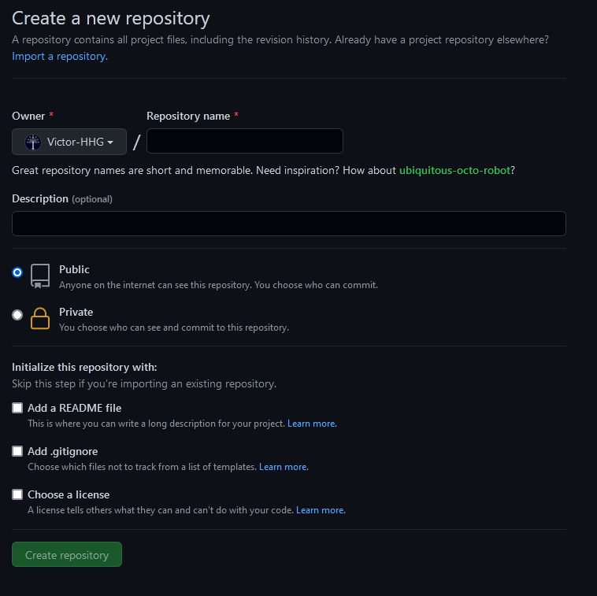
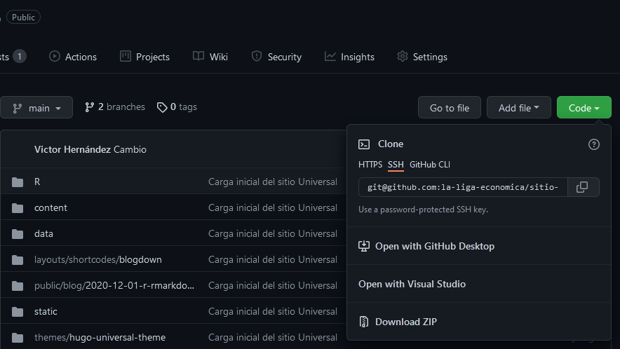
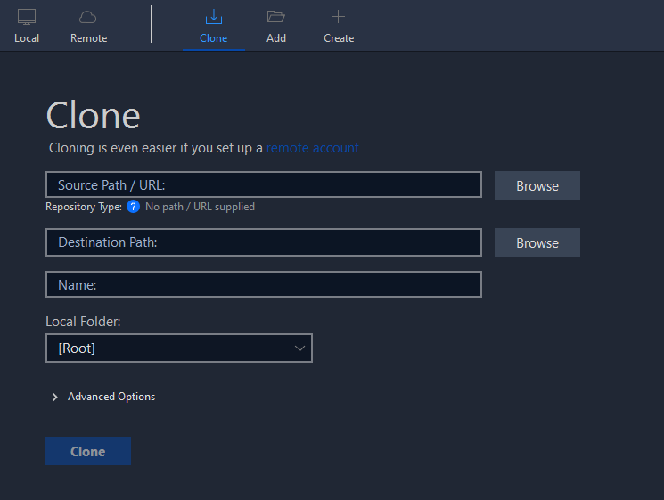
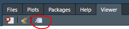
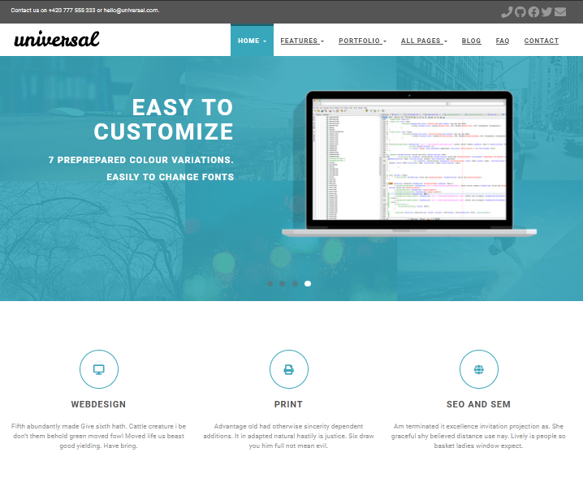

## Introducción

Este sitio web y todas sus publicaciones son creadas mediante herramientas de código abierto que cualquiera puede descargar
y empezar a utilizar fácilmente. En esta publicación, hago una descripción de los pasos que seguimos para crear el sitio,
la configuración básica y los pasos a seguir para añadir y editar publicaciones.

Esta es la lista de cosas que es necesario tener instaladas para que esto funcione:

- [R](https://cran.r-project.org/bin/windows/base/)
- [RStudio](https://www.rstudio.com/)
- [Git](https://gitforwindows.org/)
- [Sourcetree](https://www.sourcetreeapp.com/)

Si ya estas familiarizado con git, este último programa es opcional. Requerirás también estar registrado en las siguientes
plataformas:

- [Github](https://github.com/)
- [Netlify](https://www.netlify.com/)

En Netlify puedes registrarte usando tus credenciales de Github, por lo que es un proceso sencillo.

Recomiento leer la [documentación del paquete Blogdown](https://bookdown.org/yihui/blogdown/) como punto de partida. Si
después de seguir esas instrucciones sigues teniendo dudas sobre algunos pasos, es posible que aquí encuentres la respuesta.

## Por qué Blogdown

## Instalación y configuración previa

## Creación del sitio web

### Primero el repositorio

Una vez registrado en [Github](https://github.com/), puedes crear el repositorio que contendrá los archivos de tu sitio.
El nombre del repositorio es irrelevante para el sitio; puedes verlo como el nombre de la carpeta donde están tus archivos.



Es una buena práctica incluir un archivo README durante la creación del repositorio, donde se incluirá la descripción del contenido.
Aquí puedes incluir las instrucciones para actualizar tu sitio, por ejemplo. De este modo, si dejas de lado este proyecto por
unos dias (*o meses*), no tienes que volver a buscar esas instrucciones en internet.

Puedes incluir también un archivo `.gitignore`, el cual tiene una lista de archivos que **no** te interesa mantener actualizados.
Es decir, son archivos que pueden ser modificados en tu computadora personal, pero no quieres que se carguen en tu repositorio en línea.
Si no creas este archivo durante la creación del repositorio, puedes añadirlo más adelante. Incluso, Blogdown creará este
archivo si no lo encuentra en la raíz de tu proyecto.

Una vez creado el repositorio en Github, necesitamos crear una copia local en nuestra computadora. Esto puede hacerse directamente
desde RStudio, [siguiendo estas instrucciones](https://happygitwithr.com/new-github-first.html). Sin embargo, como señalé
antes, el manejador de RStudio para git puede causar que el programa se congele, por lo que recomiendo usar Sourcetree para esto.

### Clonar el repositorio con Sourcetree y empezar un proyecto

Asumiendo que ya tienes [Sourcetree y Github asociados correctamente](#instalación-y-configuración-previa), el siguiente
paso es clonar el repositorio, es decir, crear una copia local en tu computadora, de los archivos cargados en Github. 

En la vista de tu repositorio, busca el botón "Code", selecciona la opción de "SSH" y copia el texto.



En una pestaña nueva de Sourcetree, elige la opción "*Clone*" e introduce el texto copiado en el campo para el "URL".
En "*Destination Path*" selecciona la carpeta donde quieres descargar los archivos. Debería ser una carpeta vacía.
Si todo sale bien, Sourcetree descargará tus archivos `README` y `.gitignore` en la carpeta que seleccionaste.



Ahora que tienes una carpeta con los archivos de Github, puedes crear un nuevo proyecto usando RStudio, usando la carpeta
que acabas de crear. Es importante crear el proyecto en la raiz de la carpeta y no en subcarpetas. De lo contrario, 
podrías tener problemas al conectar tu repositorio con Netlify. 

### Crear el sitio usando *Blogdown*

Si seguiste el tutorial de la [documentación del paquete Blogdown](https://bookdown.org/yihui/blogdown/), ya tienes instalados
el paquete Blogdown y sus paquetes complementarios. Si no lo has hecho, te recomendamos hacerlo.

El mejor flujo de trabajo es crear el sitio después de haber elegido un tema. En este caso, usaremos el
[tema *Universal*](https://themes.gohugo.io/themes/hugo-universal-theme/), pero puedes elegir una gran variedad de temas
en el [sitio de Hugo](https://themes.gohugo.io/).

**Una advertencia sobre el tema *Academic* **. A pesar de su popularidad (prácticamente todos los tutoriales que consulté
lo usaban), el creador de este tema ha hecho cambios en su funcionamiento que [limitan su compatibilidad con *Blogdown*](https://github.com/rstudio/blogdown/issues/638), por lo que los creadores
de *Blogdown* en su lugar recomiendan el [tema *Apéro*](https://hugo-apero-docs.netlify.app/), el cual tiene funcionalidades
similares.

Entonces, para crear un sitio basado en el tema que elegiste, necesitas identificar la fuente del tema. Esto es, la dirección del 
repositorio donde se encuentra el tema. En nuestro caso, el tema *Universal* se encuentra en el siguiente repositorio:
`https://github.com/devcows/hugo-universal-theme`. Lo que necesitamos son las dos últimas partes de este URL, las cuales
se refieren al nombre de quién creó el repositorio ("devcows") y el nombre del repositorio ("hugo-universal-theme").
Para crear el sitio, basta con ejecutar el sigiente comando en la consola de RStudio.

```{r, eval=FALSE}
blogdown::new_site(theme = "devcows/hugo-universal-theme")
```

Esta función puede tener más argumentos, pero para la creación de este sitio dejamos todo lo demás por default. Posiblemente
el sistema te pida que instales *Hugo*, para lo cual hay que seguir las instrucciones que te aparezcan en la pantalla. 
Cuando R termine de descargar los archivos del tema, te preguntará si quieres mostrar el sitio, a lo cual hay que responder
`y` si lo deseas en este momento, o `n` si deseas hacerlo más adelante mediante la función `blogdown::serve_site()`.

Si elegiste mostrar el sitio, o usaste la función `blogdown::serve_site()`, RStudio te mostrará una vista previa del sitio
en la ventana "*Viewer*". Puedes ver tu sitio también en el navegador de internet si presionas este botón



Si todo salió bien, deberías ver algo como la siguiente captura. En cambio, si lo que ves no se parece a esto y en su
lugar hay sólo texto sin colores, es posible que el primer cambio en la configuración que mostraremos en la siguiente
sección lo solucione. 



## Configuración del tema

## Creación y actualización de publicaciones